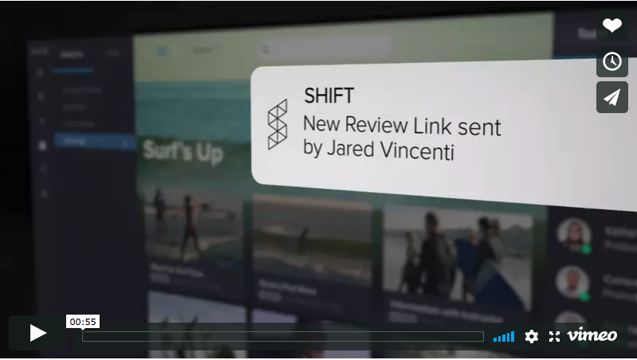

## Shift Engineering

#### What we do

Creating great content can be difficult. But your tools shouldn’t be. SHIFT gives content creators the ability to tell their stories effectively in a rapidly shifting industry rife with challenges. We’re establishing an environment where creators of all types can free themselves from hurdles and standard operating systems. Where you can look beyond what’s already been done, think freely, and develop exceptional, valuable creative.

Learn more at [shift.io](https://shift.io/)

## Openings
* [Site Reliability Engineer (SRE)](description-sre.md)
* [Software Design Engineer in Test (SDET)](description-sdet.md)
* [Release Manager](description-release-manager.md)
* [Front End Engineer](description-sre.md)
* [Video Engineer](description-sre.md)
